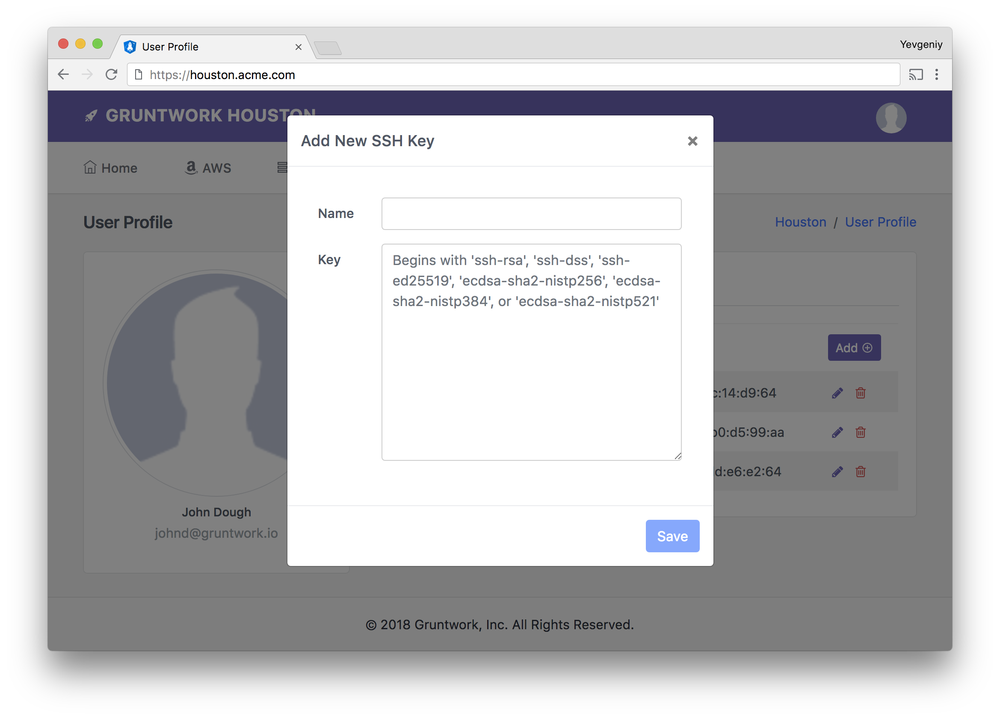

**Note**: This public repo contains the documentation for the private GitHub repo <https://github.com/gruntwork-io/module-security>.
We publish the documentation publicly so it turns up in online searches, but to see the source code, you must be a Gruntwork customer.
If you're already a Gruntwork customer, the original source for this file is at: <https://github.com/gruntwork-io/module-security/blob/master/modules/ssh-grunt/core-concepts.md>.
If you're not a customer, contact us at <info@gruntwork.io> or <http://www.gruntwork.io> for info on how to get access!

## Setup instructions

To use `ssh-grunt`, you need to do the following:

1. [Upload public SSH Keys](#upload-public-ssh-keys)
1. [Install ssh-grunt on your servers](#install-ssh-grunt-on-your-servers)
1. [Set up IAM permissions](#set-up-iam-permissions)
1. [Test it out](#test-it-out)

See the [ssh-grunt example](/examples/ssh-grunt) for fully working code samples.


### Upload public SSH Keys

Each developer on your team will need to upload their public SSH key using one of the following instructions:

1. [Upload public SSH Keys to IAM](#upload-public-ssh-keys-to-iam)
1. [Upload public SSH Keys to Houston](#upload-public-ssh-keys-to-houston)

#### Upload public SSH Keys to IAM

Login to the [IAM console](https://console.aws.amazon.com/iam/home) and click on your User Name in the Users section.
At the bottom of the Security Credentials tab, click the "Upload SSH public key" button, and enter the contents of
your public SSH key (which is typically stored in `~/.ssh/id_rsa.pub`):


#### Upload public SSH Keys to Houston

Login to Houston (you'll have to get the URL from an admin; it's typically something like `houston.your-company.com`),
click on your Profile in the top right corner, and select SSH Keys. In the page that comes up, click the "Add" button,
and enter the contents of your public SSH key (which is typically stored in `~/.ssh/id_rsa.pub`):




### Install ssh-grunt on your servers

`ssh-grunt` consists of a single binary. The easiest way to get it onto your servers is to use the [Gruntwork
Installer](https://github.com/gruntwork-io/gruntwork-installer) (make sure to replace `<VERSION>` below with the latest
version from the [releases page](https://github.com/gruntwork-io/module-security-public/releases)):

```
gruntwork-install --binary-name ssh-grunt --repo https://github.com/gruntwork-io/module-security --tag <VERSION>
```

Alternatively, you can download the binary from the [Releases
Page](https://github.com/gruntwork-io/module-security-public/releases). On systems with SELinux, such as CentOS, you'll also
need to install the [ssh-grunt-selinux-policy module](/modules/ssh-grunt-selinux-policy).

**Important note**: We recommend installing `ssh-grunt` as part of a [Packer template](https://www.packer.io/) and
building an AMI with it. If you are installing `ssh-grunt` interactively (e.g., for learning / experimentation) or
as part of a User Data script, then you must restart `sshd` in order for the changes above to take effect! E.g.,
depending on your OS, you'd have to run something like:

```bash
sudo service sshd reload
```

Once the binary is on the server, run one of the following install commands:

1. [install-iam](#install-iam)
1. [install-houston](#install-houston)

#### Install IAM

If you're using `ssh-grunt` with IAM, run the following:

```
ssh-grunt iam install \
  --iam-group ssh-group \
  --iam-group-sudo ssh-sudo-group
```

The `install` command does two things:

1. Create a cron job to run `ssh-grunt iam sync-users` to periodically (by default, every 30 minutes) sync user accounts
   from the IAM Groups specified via the `--iam-group` and `--iam-group-sudo` option.
1. Configure SSH to use `ssh-grunt iam print-keys` to authenticate login attempts using public keys in IAM.

You can pass in multiple `--iam-group` and `--iam-group-sudo` to sync users associated with different IAM groups. For
example, if you ran:

```
ssh-grunt iam install \
  --iam-group ssh-group-dev \
  --iam-group ssh-group-stage
```

`ssh-grunt` will sync users associated with EITHER the `ssh-group-dev` IAM group or `ssh-group-stage` IAM group.

See the [CLI docs](#cli-docs) for the full list of available options.

#### Install Houston

If you're using `ssh-grunt` with Houston, run the following:

```
ssh-grunt houston install \
  --houston-url https://houston.your-company.com \
  --houston-region us-east-1 \
  --ssh-role ssh-role \
  --ssh-role-sudo ssh-role-sudo
```

The `install` command does two things:

1. Create a cron job to run `ssh-grunt houston sync-users` to periodically (by default, every 30 minutes) sync user
   accounts that have the roles configured in your IdP (i.e., in Google or ADFS) specified via the
   `--ssh-role` and `--ssh-role-sudo` option.
1. Configure SSH to use `ssh-grunt houston print-keys` to authenticate login attempts using public keys in Houston.

See the [CLI docs](#cli-docs) for the full list of available options.


### Set up IAM permissions

You need to configure IAM permissions on each server where `ssh-grunt` is running so that it can access your IdP:

1. [IAM permissions for ssh-grunt with IAM](#iam-permissions-for-ssh-grunt-with-iam)
1. [IAM permissions for ssh-grunt with Houston](#iam-permissions-for-ssh-grunt-with-houston)

#### IAM permissions for ssh-grunt with IAM

The IAM permissions you need to configure for `ssh-grunt` depend on whether your infrastructure is deployed in a
single AWS account or multiple AWS accounts:

1. [Single AWS account with IAM](#single-aws-account-with-iam)
1. [Multiple AWS accounts with IAM](#multiple-aws-accounts-with-iam)

##### Single AWS account with IAM

`ssh-grunt` retrieves info from IAM using the AWS API. To use the API, `ssh-grunt` needs:

1. AWS credentials: the best way to provide credentials is to attach an [IAM
   Role](http://docs.aws.amazon.com/IAM/latest/UserGuide/id_roles.html) to the EC2 Instance.
1. IAM permissions: `ssh-grunt` needs an [IAM
   Policy](http://docs.aws.amazon.com/IAM/latest/UserGuide/access_policies.html) that allows the `iam:GetGroup`,
   `iam:ListSSHPublicKeys`, and `iam:GetSSHPublicKey` actions. The [iam-policies module](/modules/iam-policies) can
   provide the IAM policy with these permissions for you in the output variable `ssh_grunt_permissions`.

Check out the [ssh-grunt example](/examples/ssh-grunt) for sample code.

##### Multiple AWS accounts with IAM

If you have multiple AWS accounts, with all IAM users defined in one account (e.g., the "security" account), and EC2
Instances running in various other AWS accounts (e.g., the "dev" and "prod" accounts), then you need to give
`ssh-grunt` running on those EC2 Instances permissions to access the account where users and groups are defined:

1. In the AWS account where the IAM users are defined, use the [cross-account-iam-roles
   module](/modules/cross-account-iam-roles) to create an IAM role that allows your other AWS account(s) to access IAM
   Group and public SSH key info by specifying the ARNs of those other accounts in the
   `allow_ssh_grunt_access_from_other_account_arns` input variable. Rough example:

    ```hcl
    module "cross_account_iam_roles" {
      source = "git::git@github.com:gruntwork-io/module-security.git//modules/cross-account-iam-roles?ref=v1.0.8"

      allow_ssh_grunt_access_from_other_account_arns = ["arn:aws:iam::123445678910:root"]

      # ... (other params ommitted) ...
    }
    ```

1. In the AWS accounts where `ssh-grunt` is running, give the EC2 Instances that run `ssh-grunt` an IAM role that has
   permissions to assume an IAM role in the users account. You can create the IAM policy with this permission using
   the [iam-policies module](/modules/iam-policies) by specifying the ARN of the IAM role you created in the users
   account in the previous step in the `allow_access_to_other_account_arns` input variable and adding the policy in
   the `allow_access_to_other_accounts` output variable to the EC2 Instance's IAM role.

    ```hcl
    module "iam_policies" {
      source = "git::git@github.com:gruntwork-io/module-security.git//modules/iam-policies?ref=v1.0.8"

      # ssh-grunt is an automated app, so we can't use MFA with it
      trust_policy_should_require_mfa    = false
      iam_policy_should_require_mfa      = false
      allow_access_to_other_account_arns = ["arn:aws:iam::111111111111:role/allow-ssh-grunt-access-from-other-accounts"]
      # ... (other params ommitted) ...
    }

    resource "aws_iam_role_policy" "ssh_grunt_external_account_permissions" {
      name = "ssh-grunt-external-account-permissions"
      role = "${module.example_instance.iam_role_id}"
      policy = "${element(module.iam_policies.allow_access_to_other_accounts, 0)}"
    }
    ```

1. When you're calling `ssh-grunt iam install`, pass the ARN of the IAM role from the other account using `--role-arn`
   argument.

    ```
    ssh-grunt iam install \
      --iam-group ssh-users \
      --role-arn arn:aws:iam::111111111111:role/allow-ssh-grunt-access-from-other-accounts
    ```

Check out the [ssh-grunt example](/examples/ssh-grunt) for sample code and pay attention to the `external_account_arn`
input variable.

#### IAM permissions for ssh-grunt with Houston

The IAM permissions you need to configure for `ssh-grunt` depend on whether your infrastructure is deployed in a
single AWS account or multiple AWS accounts:

1. [Single AWS account with Houston](#single-aws-account-with-houston)
1. [Multiple AWS accounts with Houston](#multiple-aws-accounts-with-houston)

##### Single AWS account with Houston

Gruntwork Houston runs on top of [API Gateway](https://aws.amazon.com/api-gateway/), so it can control access to the
SSH endpoints using [IAM permissions](https://docs.aws.amazon.com/apigateway/latest/developerguide/permissions.html).
To use the API, `ssh-grunt` needs:

1. AWS credentials: the best way to provide credentials is to attach an [IAM
   Role](http://docs.aws.amazon.com/IAM/latest/UserGuide/id_roles.html) to the EC2 Instance.
1. IAM permissions: `ssh-grunt` needs an [IAM
   Policy](http://docs.aws.amazon.com/IAM/latest/UserGuide/access_policies.html) that allows the `GET` access to the
   `/api/users` endpoint. The [iam-policies module](/modules/iam-policies) can provide the IAM policy with these
   permissions for you in the output variable `ssh_grunt_houston_permissions`.

Check out the [ssh-grunt example](/examples/ssh-grunt) for sample code.

##### Multiple AWS accounts with Houston

If you have multiple AWS accounts, and Houston is deployed in a separate AWS account from where your EC2 Instances
are running, then you need to give `ssh-grunt` running on those EC2 Instances permissions to access the account where
Houston is deployed:

1. In the AWS account where Houston is deployed, use the [cross-account-iam-roles
   module](/modules/cross-account-iam-roles) to create an IAM role that allows your other AWS account(s) to access the
   Houston SSH APIs  `allow_ssh_grunt_houston_access_from_other_account_arns` input variable. Rough example:

    ```hcl
    module "cross_account_iam_roles" {
      source = "git::git@github.com:gruntwork-io/module-security.git//modules/cross-account-iam-roles?ref=v1.0.8"

      allow_ssh_grunt_houston_access_from_other_account_arns = ["arn:aws:iam::123445678910:root"]

      # ... (other params ommitted) ...
    }
    ```

1. In the AWS accounts where `ssh-grunt` is running, give the EC2 Instances that run `ssh-grunt` an IAM role that has
   permissions to assume an IAM role in the Houston account. You can create the IAM policy with this permission using
   the [iam-policies module](/modules/iam-policies) by specifying the ARN of the IAM role you created in the Houston
   account in the previous step in the `allow_access_to_other_account_arns` input variable and adding the policy in
   the `allow_access_to_other_accounts` output variable to the EC2 Instance's IAM role.

    ```hcl
    module "iam_policies" {
      source = "git::git@github.com:gruntwork-io/module-security.git//modules/iam-policies?ref=v1.0.8"

      # ssh-grunt is an automated app, so we can't use MFA with it
      trust_policy_should_require_mfa    = false
      iam_policy_should_require_mfa      = false
      allow_access_to_other_account_arns = ["arn:aws:iam::111111111111:role/allow-ssh-grunt-houston-access-from-other-accounts"]
      # ... (other params ommitted) ...
    }

    resource "aws_iam_role_policy" "ssh_grunt_external_account_permissions" {
      name = "ssh-grunt-external-account-permissions"
      role = "${module.example_instance.iam_role_id}"
      policy = "${element(module.iam_policies.allow_access_to_other_accounts, 0)}"
    }
    ```

1. When you're calling `ssh-grunt houston install`, pass the ARN of the IAM role from the other account using `--role-arn`
   argument.

    ```
    ssh-grunt houston install \
      --houston-url https://houston.your-company.com \
      --houston-region us-east-1 \
      --ssh-role ssh-users \
      --ssh-role-sudo ssh-sudo-users      \
      --role-arn arn:aws:iam::111111111111:role/allow-ssh-grunt-houston-access-from-other-accounts
    ```

Check out the [ssh-grunt example](/examples/ssh-grunt) for sample code.


### Test it out

You should now be able to SSH to your servers using your IdP user name and public key (note, if a server has just
booted, it will only sync users from your IdP after ~90 seconds, so be patient!). For example, if you installed
`ssh-grunt` on an EC2 Instance with IP address `11.22.33.44` and your IdP user name is `grunt`, you can now connect to
the server as follows:

```
ssh grunt@11.22.33.44
```

That's all there is to it! No Key Pair files or passwords to worry about and as you update users in IAM, your servers
will sync up automatically!

Note: if you're using `ssh-grunt` with Houston, you must have logged into Houston with the last 12 hours in order for
SSH access to work. If you haven't done so, simply open up the browser and login now! Alternatively, you can install
the [Houston CLI](https://github.com/gruntwork-io/houston) and use it to SSH to servers:

```
houston ssh grunt@11.22.33.44
```

`houston` will automatically check if you've authenticated to Houston recently, and if not, it'll open up your browser
to let you login.

To learn more, check out the [How it works](#how-it-works) docs to see what's happening under the hood, and the
[CLI docs](#cli-docs) to learn all the parameters and options you can tweak.


## How it works

`ssh-grunt` consts of two main pieces:

1. [Syncing users](#syncing-users)
1. [Authenticating requests with public keys](#authenticating-requests-with-public-keys)


### Syncing users

`ssh-grunt` can automatically sync users from:

1. [Syncing users from IAM](#syncing-users-from-iam)
1. [Syncing users from Houston](#syncing-users-from-houston)

#### Syncing users from IAM

When you run `ssh-grunt iam install`, it adds a cron job that periodically runs the `ssh-grunt iam sync-users` command.
The `sync-users` command does the following:

1. Fetch the users from the IAM Group specified via the `--iam-group` option and for each one, create an OS user on
   the EC2 Instance. All of these OS users get added to the OS group `ssh-grunt-non-sudo-group`.
1. Fetch the users from the IAM Group specified via the `--iam-group-sudo` option and for each one, create an OS user
   that has sudo privileges on the EC2 Instance. All of these OS users get added to the OS group `ssh-grunt-sudo-group`.
1. Remove any users in the `ssh-grunt-non-sudo-group` and `ssh-grunt-sudo-group` groups that are not in the corresponding
   IAM group.

#### Syncing users from Houston

When you run `ssh-grunt houston install`, it adds a cron job that periodically runs the `ssh-grunt houston sync-users`
command. The `sync-users` command does the following:

1. Fetch the list of users who have logged into Houston in the last 12 hours and had the role specified via the
   `--ssh-role` option and for each one, create an OS user on the EC2 Instance. All of these OS users get added to the
   OS group `ssh-houston-non-sudo-group`.
1. Fetch the list of users who have logged into Houston in the last 12 hours and had the role specified via the
   `--ssh-role-sudo` option and for each one, create an OS user that has sudo privileges on the EC2 Instance. All of
   these OS users get added to the OS group `ssh-houston-sudo-group`.
1. Remove any users in the `ssh-houston-non-sudo-group` and `ssh-houston-sudo-group` groups that are no longer returned
   by Houston.

#### A note on user names

Note that the requirements for OS user names are stricter than those of other IdPs, such as IAM. Therefore, the OS user
name created by the `sync-users` command may not exactly match your IdP user name. In particular, OS user names must
start with a letter, followed by letters, numbers, underscores, and dashes, and be no more than 32 characters long.
Therefore, `ssh-grunt` does the following:

1. Drop anything after the @ symbol in email addresses (e.g. "foo@bar.com" --> "foo").
1. Replace whitespace and periods with underscores (e.g. "foo.bar baz" --> "foo_bar_baz").
1. Drop all other illegal characters (e.g. "foo$@%,!bar" --> "foobar").
1. Drop any leading punctuation or numbers (e.g. ".,123foo" --> "foo").
1. Truncate all strings over 32 characters long.

We store the original user name in the comment field of the OS user so we can retrieve it when the user tries to
authenticate with their public key.


### Authenticating requests with public keys

When you run `install` command of `ssh-grunt`, it modifies the `AuthorizedKeysCommand` in `/etc/ssh/sshd_config`. When
a user tries to connect via SSH, SSH will execute the `AuthorizedKeysCommand` (passing it the username as the first
argument) and whatever text that command writes to stdout will be used as the `authorized_keys`—that is, the list of
public keys that are allowed to connect to the server.

We take advantage of this `AuthorizedKeysCommand` by configuring it to run `ssh-grunt iam print-keys` or
`ssh-grunt houston print-keys` command, which looks up the user's public keys in IAM or Houston and prints all the
active keys to stdout. That way, all a user has to do is upload their public keys to IAM or Houston and they will be
able to authenticate to any server with `ssh-grunt`.

Note that SSH is very picky about the program it executes for the `AuthorizedKeysCommand` (See the [sshd_config
docs](http://man.openbsd.org/cgi-bin/man.cgi/OpenBSD-current/man5/sshd_config.5) for details):

* The program must not use any custom arguments, must be owned by root, must not be writable by group or others, and
  must be specified by an absolute path. To meet these requirements, we create a script under `/opt/ssh-grunt` that runs
  the `print-keys` command of `ssh-grunt`.
* The program must be executed under a user specified via the `AuthorizedKeysCommandUser` configuration. By default,
  we set this configuration to the user that runs the `install` command of `ssh-grunt`.


## CLI docs

`ssh-grunt` supports the following commands:

1. [iam print-keys](#iam-print-keys-command)
1. [iam sync-users](#iam-sync-users-command)
1. [iam install](#iam-install-command)
1. [houston print-keys](#houston-print-keys-command)
1. [houston sync-users](#houston-sync-users-command)
1. [houston install](#houston-install-command)

You can run `ssh-grunt --help` at any time to see the CLI docs.


### iam print-keys command

Usage: `ssh-grunt iam print-keys [OPTIONS] USERNAME`

Description: Find the public keys stored for the specified IAM user and print them to stdout.

Arguments:

* `USERNAME` (required): Look up the public keys for this IAM user name.

Options:

* `--role-arn` (optional): Assume this IAM role for all API calls to AWS. This is used primarily when the IAM users and
  groups are defined in another AWS account.

Examples:

```
ssh-grunt iam print-keys grunt
```


### iam sync-users command

Usage: `ssh-grunt iam sync-users [OPTIONS]`

Description: Sync the user accounts on this system with the user accounts in the specified IAM groups.

Options:

* `--iam-group` (optional): Sync the user accounts on this system with the user accounts in this IAM group. At least
  one of `--iam-group` or `--iam-group-sudo` is required.
* `--iam-group-sudo` (optional): Sync the user accounts on this system with the user accounts in this IAM group and
  give these user accounts sudo privileges. At least one of `--iam-group` or `--iam-group-sudo` is required.
* `--role-arn` (optional): Assume this IAM role for all API calls to AWS. This is used primarily when the IAM users and
  groups are defined in another AWS account.
* `--force-user-deletion` (optional): If this flag is set, delete not only the OS user, but also their home directory
  when that user is removed from an ssh-grunt managed group.
* `--dry-run` (optional): Print out what this command would do, but don't actually make any changes on this system.

Examples:

```
ssh-grunt iam sync-users \
  --iam-group ssh-group \
  --iam-group-sudo ssh-sudo-group
```


### iam install command

Usage: `ssh-grunt iam install [OPTIONS]`

Description: Configure this server to a) periodically sync user accounts from IAM and b) use ssh-grunt to authenticate
SSH connections.

Options:

* `--iam-group` (optional): Sync the user accounts on this system with the user accounts in this IAM group. At least
  one of `--iam-group` or `--iam-group-sudo` is required.
* `--iam-group-sudo` (optional): Sync the user accounts on this system with the user accounts in this IAM group and
  give these user accounts sudo privileges. At least one of `--iam-group` or `--iam-group-sudo` is required.
* `--cron-schedule` (optional): A cron expression that controls how often `ssh-grunt` syncs IAM users to this system.
  Default: `*/30 * * * *` (every 30 minutes).
* `--authorized-keys-command-user` (optional): The user that should execute the SSH AuthorizedKeysCommand. Default:
  current user.
* `--role-arn` (optional): Assume this IAM role for all API calls to AWS. This is used primarily when the IAM users and
  groups are defined in another AWS account.
* `--force-user-deletion` (optional): If this flag is set, delete not only the OS user, but also their home directory
  when that user is removed from an ssh-grunt managed group.
* `--dry-run` (optional): Print out what this command would do, but don't actually make any changes on this system.

Examples:

```
ssh-grunt iam install \
  --iam-group ssh-users \
  --iam-group-sudo ssh-sudo-users
```


### houston print-keys command

Usage: `ssh-grunt houston print-keys [OPTIONS] USERNAME`

Description: Find the public keys stored for the specified user in Houston and print them to stdout.

Arguments:

* `USERNAME` (required): Look up the public keys for this user name. This is a username in an IdP supported by Houston,
  such as ADFS or Google.

Options:

* `--houston-url` (required): The URL of your Gruntwork Houston deployment.
* `--houston-region` (required): The AWS region where Gruntwork Houston is deployed.
* `--role-arn` (optional): Assume this IAM role for all API calls to AWS. This is used primarily when Houston is
  deployed in another AWS account.

Examples:

```
ssh-grunt houston print-keys \
  --houston-url https://houston.your-company.com \
  --houston-region us-east-1 \
  grunt
```


### houston sync-users command

Usage: `ssh-grunt houston sync-users [OPTIONS]`

Description: Sync the user accounts on this system with the user accounts that have the specified roles.

Options:

* `--houston-url` (required): The URL of your Gruntwork Houston deployment.
* `--houston-region` (required): The AWS region where Gruntwork Houston is deployed.
* `--ssh-role` (optional): Sync the user accounts on this system with the user accounts that have logged into Houston
  in the last 12 hours with this role. At least one of `--ssh-role` or `--ssh-role-sudo` is required.
* `--ssh-role-sudo` (optional): Sync the user accounts on this system with the user accounts that have logged into Houston
  in the last 12 hours with this role and give these user accounts sudo privileges. At least one of `--ssh-role` or
  `--ssh-role-sudo` is required.
* `--role-arn` (optional): Assume this IAM role for all API calls to AWS. This is used primarily when Houston is
  deployed in another AWS account.
* `--force-user-deletion` (optional): If this flag is set, delete not only the OS user, but also their home directory
  when that user is removed from an ssh-grunt managed group.
* `--dry-run` (optional): Print out what this command would do, but don't actually make any changes on this system.

Examples:

```
ssh-grunt houston sync-users \
  --houston-url https://houston.your-company.com \
  --houston-region us-east-1 \
  --iam-group ssh-group \
  --iam-group-sudo ssh-sudo-group
```


### houston install command

Usage: `ssh-grunt houston install [OPTIONS]`

Description: Configure this server to a) periodically sync user accounts from Houston and b) use ssh-grunt to
authenticate SSH connections.

Options:

* `--houston-url` (required): The URL of your Gruntwork Houston deployment.
* `--houston-region` (required): The AWS region where Gruntwork Houston is deployed.
* `--ssh-role` (optional): Sync the user accounts on this system with the user accounts that have logged into Houston
  in the last 12 hours with this role. At least one of `--ssh-role` or `--ssh-role-sudo` is required.
* `--ssh-role-sudo` (optional): Sync the user accounts on this system with the user accounts that have logged into Houston
  in the last 12 hours with this role and give these user accounts sudo privileges. At least one of `--ssh-role` or
  `--ssh-role-sudo` is required.
* `--cron-schedule` (optional): A cron expression that controls how often ssh-grunt syncs IAM users to this system.
  Default: `*/30 * * * *` (every 30 minutes).
* `--authorized-keys-command-user` (optional): The user that should execute the SSH AuthorizedKeysCommand. Default:
  current user.
* `--role-arn` (optional): Assume this IAM role for all API calls to AWS. This is used primarily when Houston is
  deployed in another AWS account.
* `--force-user-deletion` (optional): If this flag is set, delete not only the OS user, but also their home directory
  when that user is removed from an ssh-grunt managed group.
* `--dry-run` (optional): Print out what this command would do, but don't actually make any changes on this system.

Examples:

```
ssh-grunt houston install \
  --houston-url https://houston.your-company.com \
  --houston-region us-east-1 \
  --ssh-role ssh-users \
  --ssh-role-sudo ssh-sudo-users
```


## Threat model

The threat model is defined in terms of what each possible attacker can achieve.

At a high level, the security of `ssh-grunt` is predicated on the security of SSH, your IdP, and Gruntwork.


### Assumptions

* Your users act reasonably and do not reveal their secrets, such as their private SSH keys or IdP credentials.
* SSH is a secure protocol and public/private key encryption guarantees are valid.
* The AWS APIs are properly secured by TLS and IAM Roles.
* The user's computer and your servers are not compromised by malware.
* The copy of `ssh-grunt` running on your servers has not been compromised by malware.


### Threats from an SSH compromise

If an attacker gets access to one of your developer's private keys, they will be able to:

* Make arbitrary changes on the server, especially if your developer had sudo access.
* Use any IAM Roles attached to that server to authenticate to the AWS APIs. In particular, the IAM Roles you need to
  use `ssh-grunt` will allow the attacker to list the user names and public keys of other SSH users.

Possible remediation: Delete the compromised key from IAM or Houston as soon as possible, and the attacker will no
longer be able to connect to your servers.


### Threats from an IAM compromise

If you are using `gruntssh` with IAM, and your server cannot communicate with IAM, either due to an outage in AWS or a
misconfiguration on your servers:

* Your developers will not be able to authenticate to your servers using their public keys.
* User accounts will no longer automatically sync to the servers, so changes in IAM groups will not be reflected on
  your servers.

Possible remediation: Always launch servers with an [EC2 Key
Pair](https://docs.aws.amazon.com/AWSEC2/latest/UserGuide/ec2-key-pairs.html) as backup. This Key Pair should kept on
a trusted admin's computer, not shared with anyone else (if you must share it, make sure to encrypt it thoroughly using
something like [KMS](https://aws.amazon.com/kms/) or [Keybase](http://keybase.io/)), and only used in case of
emergencies.

If an attacker gets access to an IAM user account, they will be able to:

* Make arbitrary changes to your AWS account, depending on the permissions attached to that IAM account.
* Add their own public key to their IAM account and add that account to an IAM group that has SSH access. This will
  allow them to SSH to your servers using their public key and make arbitrary changes.

Possible remediation: Require all IAM users to use [Multi-Factor
Authentication](https://aws.amazon.com/iam/details/mfa/) and secure passwords to reduces the chances of an account
being compromised. You can even require [Multi-Factor Authentication for particularly sensitive API
calls](https://docs.aws.amazon.com/IAM/latest/UserGuide/id_credentials_mfa_configure-api-require.html), such as any
changes in IAM or KMS. Follow the [principle of least
privilege](https://en.wikipedia.org/wiki/Principle_of_least_privilege) and grant IAM users the bare-minimum permissions
they need, so if an IAM account is compromised, the attacker's abilities are limited.


### Threats from an IdP compromise

If an attacker gets access to a user account in the IdP (e.g., ADFS or Google) you use with Houston, they
will be able to:

* Make arbitrary changes to in the IdP itself, depending on the permissions attached to that IdP user.
* Make arbitrary changes to your AWS account, depending on the permissions attached to that IdP user.

Possible remediation: ensure you require multi-factor authentication for your IdP and require all users to use secure
passwords to reduce the chances of a compromised account.


### Threats from a Houston compromise

If you are using `gruntssh` with Gruntwork Houston, and your server cannot communicate with Houston, either due to an
outage in Houston or a misconfiguration on your servers:

* Your developers will not be able to authenticate to your servers using their public keys.
* User accounts will no longer automatically sync to the servers, so changes in IdP roles will not be reflected on
  your servers.

Possible remediation: Always launch servers with an [EC2 Key
Pair](https://docs.aws.amazon.com/AWSEC2/latest/UserGuide/ec2-key-pairs.html) as backup. This Key Pair should kept on
a trusted admin's computer, not shared with anyone else (if you must share it, make sure to encrypt it thoroughly using
something like [KMS](https://aws.amazon.com/kms/) or [Keybase](http://keybase.io/)), and only used in case of
emergencies.

If an attacker manages to compromise Houston itself, and replace its code with their own, they will be able to:

* Make use of the AWS permissions of any user that logs in via Houston and thereby make arbitrary changes to your
  AWS account, depending on the permissions attached to that IdP user.


### Threats from a Gruntwork compromise

If an attacker gets access to Gruntwork's repos, they will be able to:

* Replace the `ssh-grunt` binary in the [module-security repo](https://github.com/gruntwork-io/module-security-public) with one
  that contains malware. This will allow the attacker to make arbitrary changes on any server where `ssh-grunt` is
  installed.
* Replace the Houston source code with code that contains malware. See the previous section for the problems this may
  cause.

Possible remediation: Gruntwork only grants write access to its repos to employees, all of whom are required to use
Multi-Factor Authentication and strong passwords. In the future, we will publish checksums of our binaries in separate
locations so you can use those to confirm that the binary you are installing is an authentic one.


## Developing ssh-grunt

Since ssh-grunt makes lots of changes to the OS (creating users, modifying SSH settings, etc), we recommend running it
in a Docker container.


### Building the Docker image

The Docker image is defined in the `Dockerfile`. To build it, run:

```
docker build -t gruntwork/ssh-grunt .
```


### Running locally

To run the app locally, we've defined a `docker-compose.yml` file that mounts source code into the Docker container
(so you don't have to keep rebuilding the container when you make source changes) and forwards our AWS environment
variables. To run the app with Docker Compose:

```
docker-compose run ssh-grunt [ARGS...]
```

For example:

```
docker-compose run ssh-grunt iam print-keys myuser
```


### Stacktraces

If you run the app and it crashes on you, set the `SSH_GRUNT_DEBUG` environment variable to any value to see the
stacktrace:

```
docker-compose run -e SSH_GRUNT_DEBUG=true ssh-grunt iam print-keys myuser
```


### Running tests

**Note**: the automated tests for this repo (a) make many changes in the OS, include creating lots of OS users, so
we only recommend running them within a Docker container and (b) create and delete real IAM users and groups in your
AWS account, so always let them run to completion so they can do proper cleanup.

To run all the tests, use the `test.sh` script, which uses Docker Compose under the hood:

```
./_ci/test.sh
```

To run a specific test, use the `-run` argument:

```
./_ci/test.sh -run TestFoo
```


## Possible future additions

Some items we are considering for the future:

1. Set up two-factor auth (2FA) using `libpam-google-authenticator`.
1. Lock down SSH settings by disabling password authentication and the root user.
1. Lock down SSH even more: https://stribika.github.io/2015/01/04/secure-secure-shell.html
1. Send notifications for all server access: https://www.inversoft.com/guides/2016-guide-to-user-data-security#intrusion-detection

If you're interested in these features, [let us know](support@gruntwork.io)!
